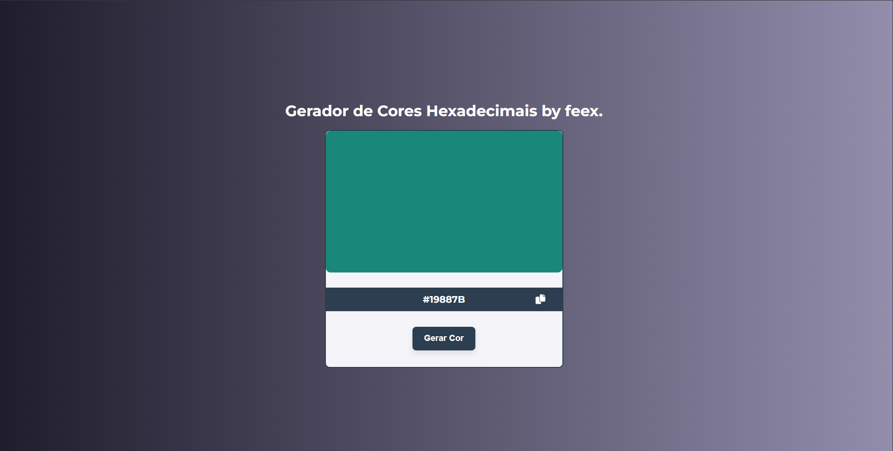

# 🎨 Gerador de Cor Hexadecimal

Este é um projeto simples e moderno feito com **HTML, CSS e JavaScript** que gera uma cor hexadecimal aleatória, aplica a cor em uma caixa e permite copiar o valor com um clique.

- [Acesso o projeto:](https://feex11.github.io/GeradorCoresHex/)

## 📸 Preview

 >

## 🚀 Funcionalidades

- Gera uma cor hexadecimal aleatória.
- Exibe a cor em tempo real em um container visual.
- Mostra o código hexadecimal correspondente.
- Permite copiar o código com apenas um clique.
- Interface simples, responsiva e estilosa com **gradientes modernos**.

## 🛠️ Tecnologias usadas

- HTML5
- CSS3
- JavaScript
- [Font Awesome](https://cdnjs.com/libraries/font-awesome)

## 📦 Como usar

1. Clone este repositório:
   ```bash
   git clone https://github.com/feex1/GeradorCoresHex.git
   cd GeradorCoresHex
2. Abra o arquivo index.html em seu navegador.

3. Clique em "Gerar Cor" para ver uma nova cor e copie com o botão ao lado.
